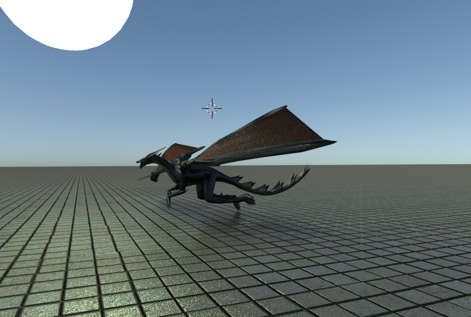
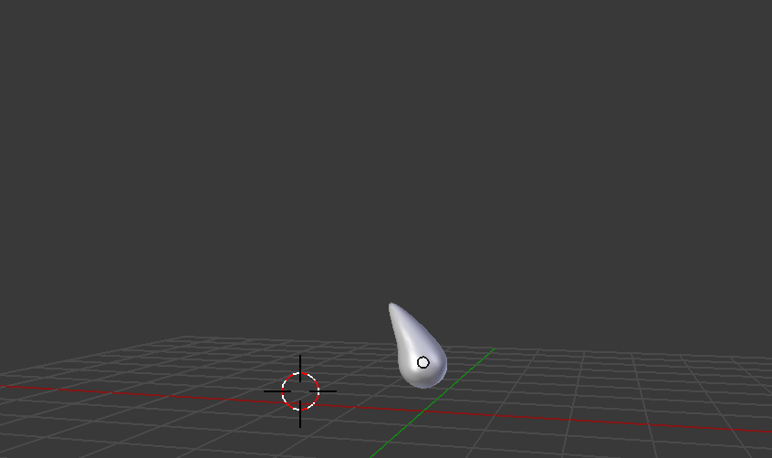

# Physical based animations and mathematical modelling 2018

# Authors

Marianna Ráchelová

Martina Bodišová

# About

Create animation of a dragon floating above the huge medieval castle. Show the dragon moving its
wings and spitting the fire. Show growing fire, show large fire, show smaller fire. Create a little story.

# Storyboard

# Final Animation 

Click below to play animation

# Diary

| Date                    | Progress                                                                           | 
|:------------------------|:-----------------------------------------------------------------------------------|
| 15/10/2018              | Finished storyboard                                                                | 
| 15/10/2018 - 31/10/2018 | Looking for dragon model and learning Blender                                      | 
| 01/11/2018 - 15/11/2018 | Creating grass with particle system , adding wind and model of castle              |
| 16/11/2018 - 29/11/2018 | Creating model of dragon egg, breaking egg animation                               |
| 30/11/2018 - 16/12/2018 | Flying dragon animation, align camera to spline path                               |
| 16/12/2018              | Creating of rain effect using particle system. Last edits,creating demo            |
| 02/01/2019 - 09/01/2019 | Improving of rain effect, creating model of rain drop.Improving of dragon's flight.|
| 10/01/2019 - 17/01/2019 | Creating animation of dragon spitting the fire.                                    |
| 18/01/2019 - 27/01/2019 | Last edits, rendering of animations, creating video.                               |

# Used effects

## Rendering

1. Quality texture on objects
2. Good gloss on surface

## Audio

3. Music used in animation
 
<a href="https://www.youtube.com/watch?v=9P0ChcQaVkU">Main music</a>
 
<a href="http://soundbible.com/543-Dragon-Roaring.html">Dragon Roaring Sound</a>
 
<a href="http://www.orangefreesounds.com/light-rain-and-thunder-sounds/">Light Rain And Thunder Sounds</a>
 
<a href="https://www.soundjay.com/nature/sounds/wind-howl-01.mp3">Wind howl</a>
 
<a href="http://soundbible.com/2127-Dragon-Fire-Breath-and-Roar.html">Dragon Fire Breath and Roar Sound</a>
 
<a href="http://soundbible.com/32-Short-Egg-Cracking.html">Short Egg Cracking Sound</a>

## Motion

4. Object's motion after the spline 
5. Camera motion after the spline
6. Sun motion after the spline
7. Dragon flight
8. Dragon walk

## Physically natural effects

9. Rain 
10. Wind
11. Collision liquid and object 
12. Grass with hair
13. Fire - Dragon spitting the fire 

## Physical objects

13. Model of dragon egg
14. Model of rain drop
15. Collision of objects

# Creating of scenes

## Dragon egg view

We used the model of the castle from internet. Link available here <a href="https://free3d.com/3d-model/fantasy-castle-40715.html">Castle model</a>.
 
We created simple model of dragon egg. We tried to use the cell fraction to break the egg. Cell fraction is special add on using to break the object's surface. This add on use the Woronoi algorithm for breaking surface as well. Unfortunately this add on is using Blender game engine and this kind of add on is incompatible with Particle system. Engine is used for rendering. We decided to not include cracking surface of dragon's egg in final animation. 
 
Next we created green grass using Particle system. First we added new mesh - plane. To this plane we add modifier particle system. We set up some properties like type of material - dirt and grass, type of particle system - hair, hair-length etc.
On the grass we can see the wind is blowing.

## Dragon egg view and egg's cracks

On this scene we were using camera motion after the spline. Scene where are showing egg's cracks we were using key frames to create camera motion. 
 

 

## Newborn dragon

On the third scene we can see newborn dragon. Motion of dragon is created by key frames.
 
Model of dragon available here <a href="https://free3d.com/3d-model/black-dragon-rigged-and-game-ready-92023.html">Dragon Model</a>
 

## Dragon flight

Dragon flight scene is composed by dragon's walk, raining and dragon flight. Motions of dragon are created by key frames. Rain is created by particle system. First we create mesh-plane and then we added modifier particle system. On this scene we used own model of rain drop. In particle system properties we assind this object(rain drop) to particle system modifier. 
 

## Dragon spitting the fire

On this scene dragon stands on his lower legs and spitting the fire. First we create object-fire and smoke domain. To object fire we added modifier Smoke. We set to this modifier Flow type - fire. To smoke domain we add modifier Smoke as well. We set Smoke type to "Domain". In the property "Smoke cache" we used "Bake", to make fire effect visible. Render baking is pre-computing something in order to speed up some other process later down the line.
 

## Final scene 

On final scene we created dragon's flight using key frames. Motion of object-sun is after spline. Motion of camera is created by key frames.
 

# Images

 

 

 

# Demos

# S3 theme

<a href="S3.pdf" download="S3">S3</a>
