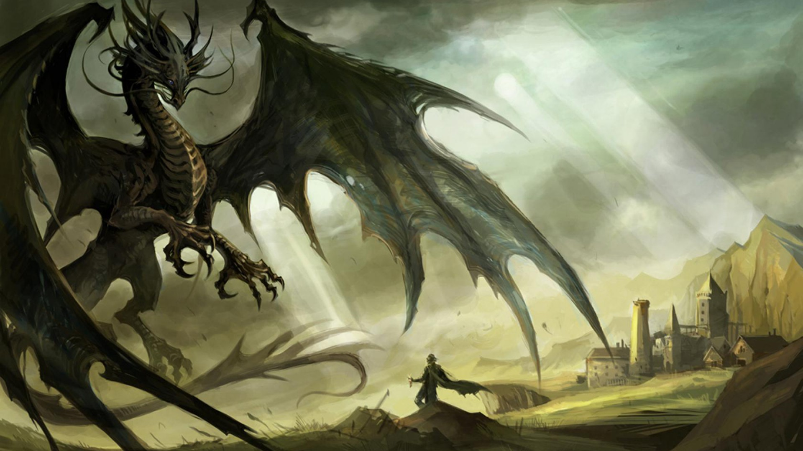
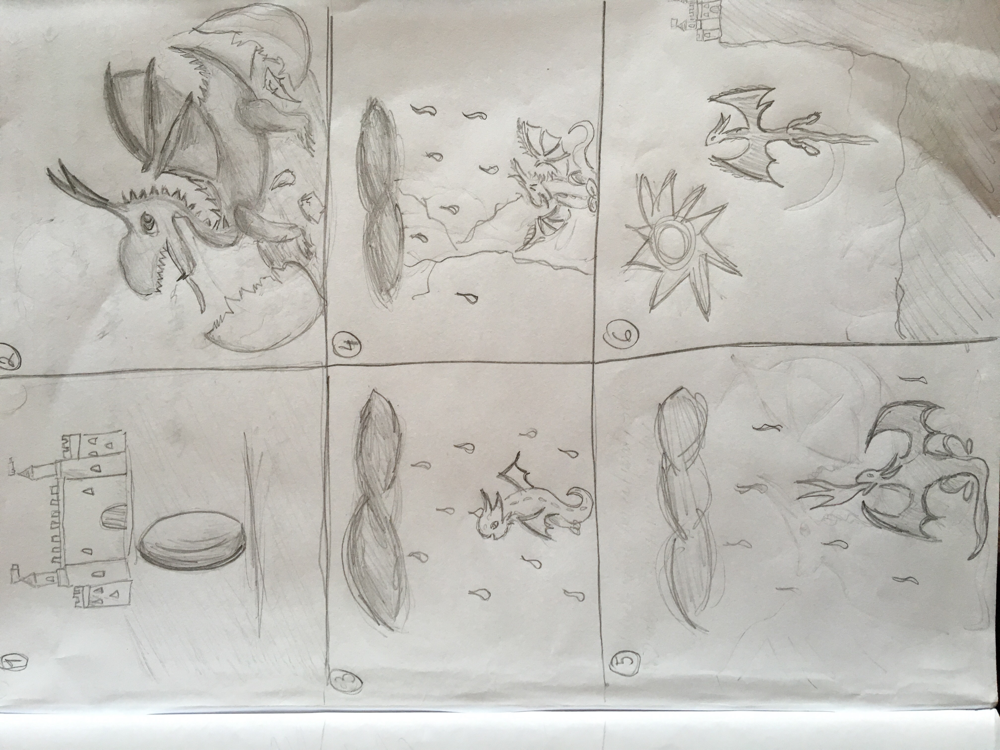

# Physical based animations and mathematical modelling 2018

# Authors

Marianna Ráchelová

Martina Bodišová

# About

Create animation of a dragon floating above the huge medieval castle. Show the dragon moving its
wings and spitting the fire. Show growing fire, show large fire, show smaller fire. Create a little story.

# Storyboard

# Diary

| Date                    | Progress                                     | 
|:------------------------|:---------------------------------------------|
| 15/10/2018              | Finished storyboard                          | 
| 15/10/2018 - 31/10/2018 | Looking for dragon model and learning Blender| 
